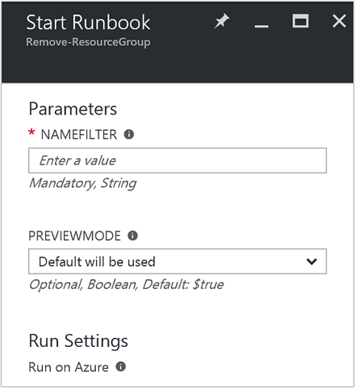
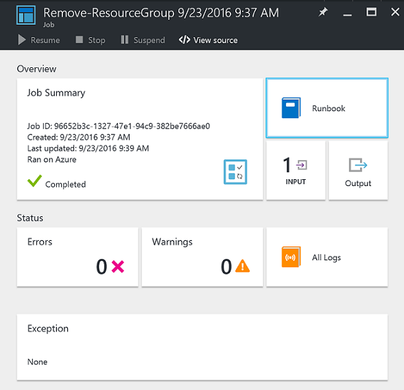

<properties
    pageTitle="Автоматизация удаления групп ресурсов | Microsoft Azure"
    description="Сценарий службы автоматизации Azure с использованием рабочего процесса PowerShell предусматривает удаление всех групп ресурсов в подписке с помощью модулей Runbook."
    services="automation"
    documentationCenter=""
    authors="MGoedtel"
    manager="jwhit"
    editor=""
	/>
<tags
    ms.service="automation"
    ms.workload="tbd"
    ms.tgt_pltfrm="na"
    ms.devlang="na"
    ms.topic="get-started-article"
    ms.date="09/26/2016"
    ms.author="magoedte"/>

# Сценарий службы автоматизации Azure: автоматизация удаления групп ресурсов

Многие пользователи создают сразу несколько групп ресурсов, одни из которых используются для управления рабочими приложениями, а другие представляют среды разработки и тестирования, а также промежуточные среды. Но автоматизация развертывания этих ресурсов и возможность удалить группу ресурсов с помощью нажатия кнопки — это две разных задачи. Использование службы автоматизации для этих целей — это прекрасная возможность оптимизировать подобные распространенные задачи управления. Это также будет полезно, если вы работаете с подпиской Azure, для которой настроена предельная сумма расходов, например, в рамках предложения для участников MSDN или программы Microsoft Partner Network Cloud Essentials.

В этом сценарии используется модуль Runbook PowerShell, который предназначен для удаления из подписки одной или нескольких выбранных групп ресурсов. Модуль Runbook поддерживает возможность тестирования перед продолжением работы, что является значением по умолчанию. Это убережет вас от случайного удаления по неосторожности или невнимательности.

## Получение сценария

В сценарии используется модуль Runbook PowerShell, который можно скачать в [коллекции PowerShell](https://www.powershellgallery.com/packages/Remove-ResourceGroup/1.0/DisplayScript) или импортировать непосредственно из [коллекции модулей Runbook](automation-runbook-gallery.md) на портале Azure.  

Модуль Runbook | Описание|
----------|------------|
Remove-ResourceGroup | Удаляет из подписки одну или несколько групп ресурсов Azure вместе со связанными ресурсами.  
  Для этого модуля Runbook определены следующие входные параметры.

Параметр | Описание|
----------|------------|
NameFilter (обязательный) | Позволяет определить имя фильтра для ограничения групп ресурсов, которые будут удалены. Можно передать несколько значений, используя запятую. Фильтр не учитывает регистр, возвращая все группы ресурсов, которые содержат строку.|
PreviewMode (необязательный) | Позволяет выполнить модуль Runbook, чтобы узнать, какие группы ресурсов будут удалены. Значение по умолчанию **true** используется, чтобы избежать случайного удаления одной или нескольких групп ресурсов, переданных в модуль Runbook.  

## Установка и настройка данного сценария

### Предварительные требования

Этот модуль Runbook выполняет проверку подлинности с помощью [учетной записи запуска от имени Azure](automation-sec-configure-azure-runas-account.md).

### Установка и публикация модулей Runbook

Скачав модули Runbook, вы можете импортировать их с помощью процедуры, описанной в статье [Создание или импорт модуля Runbook в службе автоматизации Azure](automation-creating-importing-runbook.md#importing-a-runbook-from-a-file-into-Azure-Automation). Опубликуйте модуль Runbook после импорта в учетную запись службы автоматизации.

## Использование модуля Runbook

Ниже описывается, как выполнить модуль Runbook, а также приводятся сведения о том, как этот модуль работает. В этом примере мы только протестируем модуль Runbook без удаления группы ресурсов.

1. На портале Azure откройте свою учетную запись службы автоматизации и щелкните элемент **Модули Runbook**.
2. Выберите модуль Runbook **Remove-ResourceGroup** и нажмите кнопку **Запустить**.
3. При запуске модуля Runbook открывается колонка **Запуск Runbook**, где можно настроить значения следующих параметров. Укажите имя одной или нескольких групп ресурсов в подписке, которые нужно протестировать и которые могут быть без последствий удалены.  
    
    >[AZURE.NOTE] Убедитесь, что параметру **Previewmode** присвоено значение **true**, которое препятствует случайному удалению выбранных групп ресурсов. **Учтите**, что модуль Runbook не удаляет группу ресурсов, содержащую учетную запись службы автоматизации, которая отвечает за выполнение этого модуля Runbook.

4. Настроив значения всех параметров, щелкните **ОК**. Модуль Runbook будут помещен в очередь для выполнения.

Сведения о задании Runbook **Remove-ResourceGroup** можно просмотреть на портале Azure, щелкнув плитку **Задания** этого модуля Runbook. Помимо общей информации о задании, в сводке будут перечислены входные параметры, поток вывода, а также все возникшие исключения.  .

**Сводка по заданию** содержит сообщения из потоков вывода, предупреждений и ошибок. Щелкните плитку **Вывод**, чтобы просмотреть подробные сведения о результатах выполнения модуля Runbook.  

## Дальнейшие действия

- Инструкции по созданию модулей Runbook см. в статье [Создание или импорт модуля Runbook в службе автоматизации Azure](automation-creating-importing-runbook.md).
- Инструкции по началу работы с модулями Runbook рабочих процессов PowerShell см. в статье [Первый Runbook рабочего процесса PowerShell](automation-first-runbook-textual.md).

<!---HONumber=AcomDC_0928_2016-->