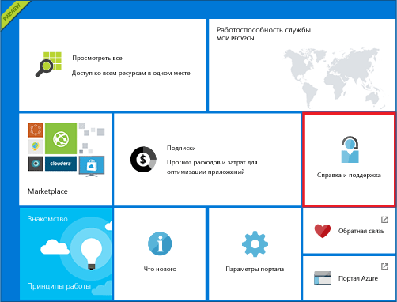
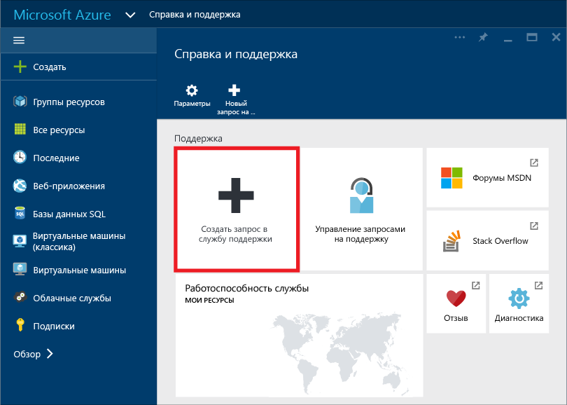
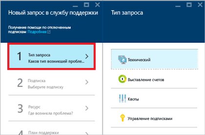
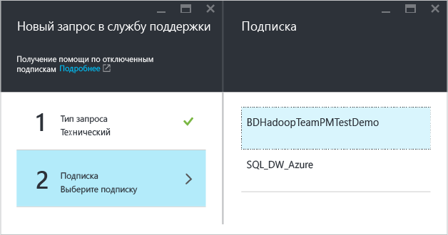
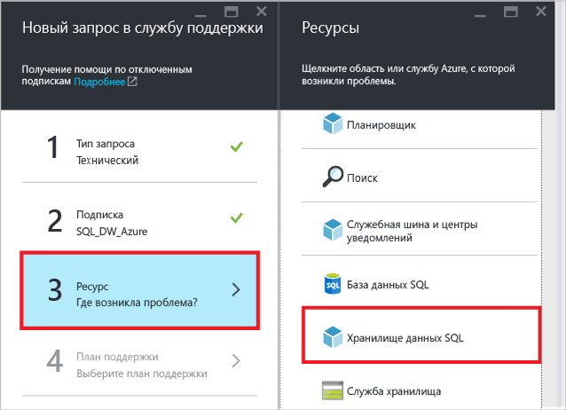
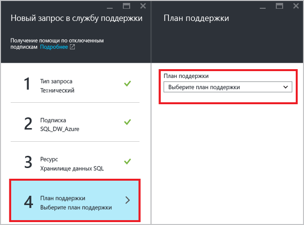
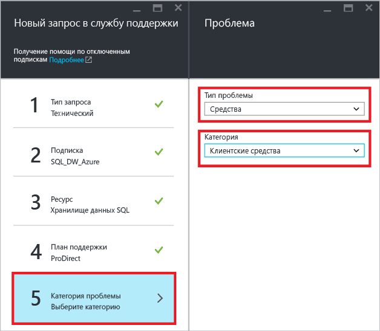
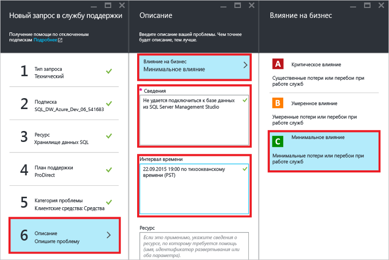
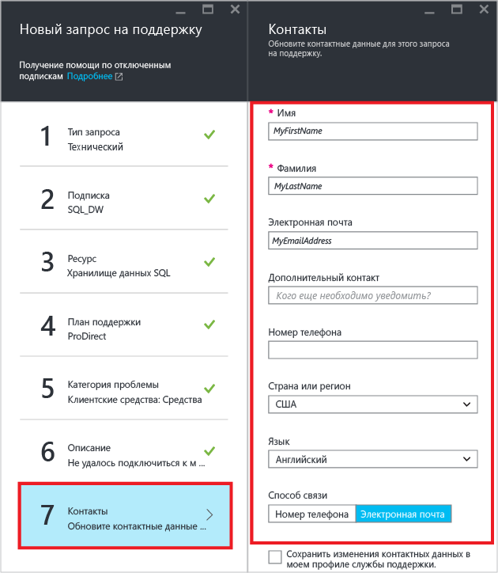
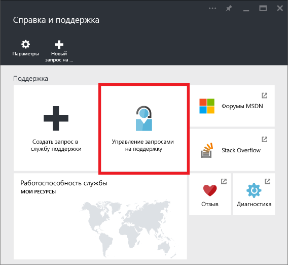

<properties
   pageTitle="Создание запроса в службу поддержки для хранилища данных SQL | Microsoft Azure"
   description="Порядок создания запроса в службу поддержки для хранилища данных SQL Azure"
   services="sql-data-warehouse"
   documentationCenter="NA"
   authors="sonyam"
   manager="barbkess"
   editor=""/>

<tags
   ms.service="sql-data-warehouse"
   ms.devlang="NA"
   ms.topic="get-started-article"
   ms.tgt_pltfrm="NA"
   ms.workload="data-services"
   ms.date="09/01/2016"
   ms.author="sonyama;barbkess"/>

# Создание запроса в службу поддержки для хранилища данных SQL
 
Если у вас возникли проблемы с хранилищем данных SQL, создайте запрос в службу поддержки, чтобы получить помощь от нашей команды разработчиков.

## Создание запроса в службу поддержки

1. Откройте [портал Azure][].

2. На начальном экране щелкните элемент **Справка + поддержка**.

    

3. В колонке «Справка + поддержка» щелкните **Создать запрос на техническую поддержку**.

    
    
    

4. Выберите **Тип запроса**.

    
    
    >[AZURE.NOTE]  По умолчанию для каждого экземпляра SQL Server (например, myserver.database.windows.net) предусмотрена следующая **квота на DTU**: 45 000. Эта квота является просто ограничением для безопасности. Вы можете увеличить квоту, отправив запрос в службу поддержки и указав *квоту* в качестве типа запроса. Чтобы вычислить потребности в DTU, умножьте 7,5 на общее необходимое количество [DWU][]. Например, вы хотите разместить две базы данных DW6000 на одном сервере SQL Server. Следует запросить квоту DTU 90 000. Текущее потребление DTU можно просмотреть в колонке SQL Server на портале. В рамках квоты DTU учитываются как приостановленные базы данных, так и базы данных с отменой приостановки.

5. Выберите **подписку**, в которой размещена база данных с соответствующей проблемой.

    

6. Выберите **хранилище данных SQL** в качестве ресурса.

    

7. Выберите свой [план поддержки Azure][].

    - Поддержка по **вопросам, связанным с выставлением счетов, квотами и управлением подпиской**, доступна на всех уровнях.
    - Поддержка по **замене или ремонту** обеспечивается на уровнях поддержки [Developer][], [Standard][], [Professional Direct][] и [Premier][]. Проблемы характера «замена или ремонт» — это возникающие при использовании Azure проблемы, относительно которых имеются обоснованные предположения, что их причиной стала корпорация Майкрософт.
    - Услуги **обучения** и **консультирования разработчиков** доступны на уровнях поддержки [Professional Direct][] и [Premier][].
    
    При наличии плана поддержки Premier можно также создавать отчеты по неполадкам хранилища данных SQL на [портале Microsoft Premier][]. Дополнительные сведения о доступной поддержке, включая области действия, время реагирования, цены и т. д., см. на странице [планов поддержки Azure][Azure support plan]. Также см. страницу [Часто задаваемые вопросы о поддержке Azure][].

    

8. Выберите значения **Тип проблемы** и **Категория**.

    

9. Опишите неполадку и выберите уровень влияния на бизнес.

    

10. Ваши **контактные данные** для этого запроса в службу поддержки будут заполнены предварительно. При необходимости обновите их.

    

11. Щелкните **Создать**, чтобы отправить запрос в службу поддержки.

## Мониторинг запроса в службу поддержки

После отправки запроса с вами свяжется представитель службы поддержки Azure. Чтобы проверить состояние запроса и сведения о нем, щелкните **Управление запросами на поддержку** на панели мониторинга.

## Другие ресурсы

Кроме того, вы можете присоединиться к сообществу пользователей хранилища данных SQL на странице [Stack Overflow][] или обратиться на [форум MSDN, посвященный хранилищу данных SQL Azure][].

<!--Image references--> 

<!--Article references--> 
[DWU]: ./sql-data-warehouse-overview-what-is.md#data-warehouse-units

<!--MSDN references--> 

<!--Other web references--> 
[портал Azure]: https://portal.azure.com/
[Azure support plan]: https://azure.microsoft.com/support/plans/?WT.mc_id=Support_Plan_510979/
[план поддержки Azure]: https://azure.microsoft.com/support/plans/?WT.mc_id=Support_Plan_510979/
[Developer]: https://azure.microsoft.com/support/plans/developer/
[Standard]: https://azure.microsoft.com/support/plans/standard/
[Professional Direct]: https://azure.microsoft.com/support/plans/prodirect/
[Premier]: https://azure.microsoft.com/support/plans/premier/
[Часто задаваемые вопросы о поддержке Azure]: https://azure.microsoft.com/support/faq/
[портале Microsoft Premier]: https://premier.microsoft.com/
[Stack Overflow]: https://stackoverflow.com/questions/tagged/azure-sqldw/
[форум MSDN, посвященный хранилищу данных SQL Azure]: https://social.msdn.microsoft.com/Forums/home?forum=AzureSQLDataWarehouse/

<!---HONumber=AcomDC_0907_2016---->